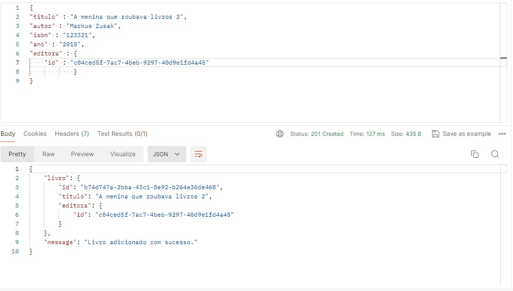

# api-biblioteca 
CRUD REST - full API with NestJs.

<p align="center">
  <a href="http://nestjs.com/" target="blank"></a>
</p>
<p align="center">A progressive <a href="http://nodejs.org" target="blank">Node.js</a> framework for building efficient and scalable server-side applications, heavily inspired by <a href="https://angular.io" target="blank">Angular</a>.</p>


## Description

<p align="center">Pós-Tech challenge at FIAP of TypeScript, Building a API (CRUD), for a library, to be consumed on the Front-end. 
In this project we used:<br><br>
<b>Nest</b> 10.0,<br>
<b>TypeScript</b> 5.1.3, <br>
<b>TypeORM</b> 0.3.20.  </p>

## Installation

```bash
$ npm install
```

## Running the app

```bash
# development
$ npm run start

# watch mode
$ npm run start:dev

# production mode
$ npm run start:prod
```
# Support

Nest is an MIT-licensed open source project. It can grow thanks to the sponsors and support by the amazing backers. If you'd like to join them, please [read more here](https://docs.nestjs.com/support).

## Stay in touch

- Author - [Diego Gervasio](https://linktr.ee/diegogervasio)
- Website - [senescenciaTech](https://senescencia.tech/)
- API - [Biblioteca for test](https://api-biblioteca-nu.vercel.app/livros/)

## License

  Nest is [MIT licensed](LICENSE).

## Example<br>
#### Books<br>
[Api](https://api-biblioteca-nu.vercel.app/livros/) <br><br>
<b>@GET</b> https://api-biblioteca-nu.vercel.app/livros/


or

<b>@GET</b> https://api-biblioteca-nu.vercel.app/livros/id

for books specific. 
 

<b>@POST</b>

- PayLoad new publishing:

```bash
{
"titulo" : "A menina que roubava livros",
"autor" : "Markus Zusak",
"isbn" : "123321",
"ano" : "2015"
"editora" : {
    "editora" : "Nova editora"
            }
}
```


- PayLoad publisher ID that exists:

```bash
{
"titulo" : "A menina que roubava livros",
"autor" : "Markus Zusak",
"isbn" : "123321",
"ano" : "2015"
"editora" : {
    "id" : "c04ced5f-7ac7-4beb-9297-40d9e1fd4a45"
            }
}
```


<b>@PUT</b>- https://api-biblioteca-nu.vercel.app/livros/id

- PayLoad:
to update publisher pass existing ID.

```bash
{
"titulo" : "A menina que roubava livros 2 put",
"autor" : "Markus Zusak",
"isbn" : "123321",
"ano" : "2015",
"editora" : {
    "id" : "32a29790-5c39-4b7b-864a-fe0cd5196bdf"
}
}
```


<b>@DELETE</b> - https://api-biblioteca-nu.vercel.app/livros/id


#### Publish<br>

[Api](https://api-biblioteca-nu.vercel.app/editora/) <br><br>
<b>@GET</b> https://api-biblioteca-nu.vercel.app/editora/


or

<b>@GET</b> https://api-biblioteca-nu.vercel.app/editora/id

for publish specific. 
 <br><br>
<b>@POST</b>

- PayLoad new publishing:

```bash
{

    "editora" : "Nova editora"
        
}
```
<br> <br>

<b>@PUT</b>- https://api-biblioteca-nu.vercel.app/editora/id

- PayLoad:
```bash
{
"editora" : "Nova editora PUT"
}
```


<b>@DELETE</b> - https://api-biblioteca-nu.vercel.app/editora/id 
<br> <br>
<b>Warning:</b> To exclude a publisher, it cannot be linked to a book.

